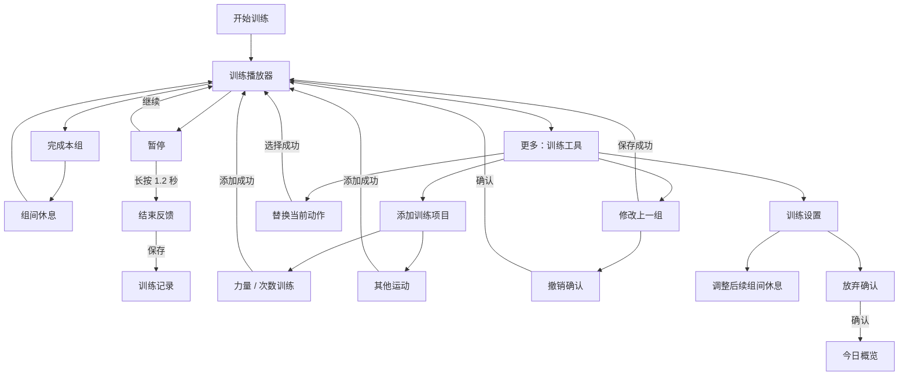

# 训练交互动线

主界面只处理当前组与暂停；「更多」作为工具目录，每次进入下一层只完成一件事。以下主线以「开始一次训练」为例，既有计划/自由训练的自动结束条件继续保留。

## 层级与返回

| 页面 | 本页任务 | 返回 / 取消 | 完成后 |
| --- | --- | --- | --- |
| 训练工具 | 选择操作；最多四个入口 | 返回训练，结束状态则返回反馈 | 进入所选子页 |
| 添加训练项目 | 选择力量或其他运动 | 返回工具 | 进入对应表单 |
| 力量 / 其他运动表单 | 选项目并填写记录 | 返回添加类型选择 | 返回训练，暂停状态保留 |
| 替换当前动作 | 搜索并选择替代动作 | 返回工具 | 返回训练，保留已完成组 |
| 修改上一组 | 调整已完成组的重量与次数 | 返回工具 | 返回训练；结束后修改则回反馈 |
| 撤销确认 | 确认是否重录这一组 | 返回修改页或保留这一组 | 返回训练，清除当前及冻结休息 |
| 训练设置 | 设置后续休息；保存即时反馈 | 返回工具 | 留在设置；当前倒计时不变 |
| 放弃确认 | 确认是否删除本次草稿 | 返回设置或保留本次训练 | 返回首页，保留历史记录 |

## 状态与反馈

- 打开工具不自动暂停，不重置开始时间或休息截止时间。目录明确显示计时继续、已暂停或已结束状态。
- 工具目录只显示当下适用的操作：未完成动作才可替换，至少完成一组才可纠错，结束反馈阶段不显示添加或替换。
- 设置与放弃分层，新增动作时不再混入休息设置。危险操作有独立确认，默认保留已有状态。
- 子页面使用一个明确的返回入口；在训练中隐藏另一个关闭弹窗的入口，避免误离开整个训练。
- 保存失败保留草稿和当前表单；休息选择保存失败会回显已保存值并提示重新选择重试。
- 主要点击区域至少 44px 高；目录入口获得初始焦点，保持键盘可操作。

## 验证

82 项 Node 回归、语法检查通过。真实 Edge 游客会话以安卓 UA 和触控走查添加运动、替换、修改、撤销/放弃取消及确认、结束后的修改反馈和保存；320×520、390×780、1280×900 无横向溢出，320px 四个目录入口均可见。

已重新构建本地 0.6.8 APK 并通过结构、资源/DEX 对齐、v2/v3 签名校验；包内四个网页资源与浏览器走查的适配资源一致。Release：[v0.6.8](https://github.com/tyrantqiao/nextStep/releases/tag/v0.6.8)。未进行安卓真机验证。
